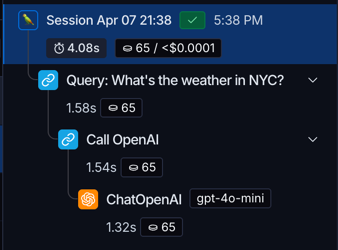
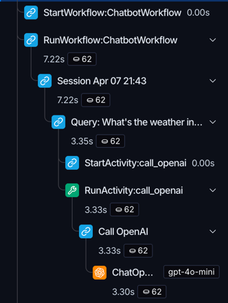
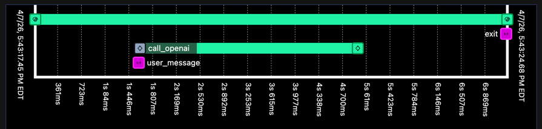
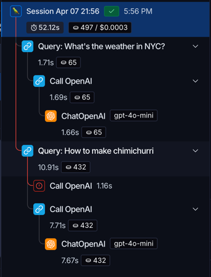

# LangSmith Plugin for Temporal Python SDK

> ⚠️ **This package is currently at an experimental release stage.** ⚠️

This Temporal [Plugin](https://docs.temporal.io/develop/plugins-guide) allows your [LangSmith](https://smith.langchain.com/) traces to work within Temporal Workflows. It propagates trace context across Worker boundaries so that `@traceable` calls, LLM invocations, and Temporal operations show up in a single connected trace, and ensures that replaying does not generate duplicate traces.

## Quick Start

Install Temporal with the LangSmith feature enabled:

```bash
uv add temporalio[langsmith]
```

Register the Plugin on your Temporal Client. You need it on both the Client (starter) side and the Workers:

```python
from temporalio.client import Client
from temporalio.contrib.langsmith import LangSmithPlugin

client = await Client.connect(
    "localhost:7233",
    plugins=[LangSmithPlugin(project_name="my-project")],
)
```

Once that's set up, any `@traceable` function inside your Workflows and Activities will show up in LangSmith with correct parent-child relationships, even across Worker boundaries.

## Example: AI Chatbot

A conversational chatbot using OpenAI, orchestrated by a Temporal Workflow. The Workflow stays alive waiting for user messages via Signals, and dispatches each message to an Activity that calls the LLM.

### Activity (Wraps the LLM Call)

```python
from langsmith import traceable

@traceable(name="Call OpenAI", run_type="chain")
@activity.defn
async def call_openai(request: OpenAIRequest) -> Response:
    client = wrap_openai(AsyncOpenAI()) # This is a traced langsmith function
    return await client.responses.create(
        model=request.model,
        input=request.input,
        instructions=request.instructions,
    )
```

### Workflow (Orchestrates the Conversation)

```python
@workflow.defn
class ChatbotWorkflow:
    @workflow.run
    async def run(self) -> str:
        # @traceable works inside Workflows — fully replay-safe
        now = workflow.now().strftime("%b %d %H:%M")
        return await traceable(
            name=f"Session {now}", run_type="chain",
        )(self._run_with_trace)()

    async def _run_with_trace(self) -> str:
        while not self._done:
            await workflow.wait_condition(
                lambda: self._pending_message is not None or self._done
            )
            if self._done:
                break

            message = self._pending_message
            self._pending_message = None

            @traceable(name=f"Query: {message[:60]}", run_type="chain")
            async def _query(msg: str) -> str:
                response = await workflow.execute_activity(
                    call_openai,
                    OpenAIRequest(model="gpt-4o-mini", input=msg),
                    start_to_close_timeout=timedelta(seconds=60),
                )
                return response.output_text

            self._last_response = await _query(message)

        return "Session ended."
```

### Worker

```python
client = await Client.connect(
    "localhost:7233",
    plugins=[LangSmithPlugin(project_name="chatbot")],
)

worker = Worker(
    client,
    task_queue="chatbot",
    workflows=[ChatbotWorkflow],
    activities=[call_openai],
)
await worker.run()
```

### What you see in LangSmith

With the default configuration (`add_temporal_runs=False`), the trace contains only your application logic:

```
Session Apr 03 14:30
  Query: "What's the weather in NYC?"
    Call OpenAI
      openai.responses.create  (auto-traced by wrap_openai)
```

An actual look at the LangSmith UI:



## `add_temporal_runs` — Temporal Operation Visibility

By default, `add_temporal_runs` is `False` and only your `@traceable` application logic appears in traces. Setting it to `True` also adds Temporal operations (StartWorkflow, RunWorkflow, StartActivity, RunActivity, etc.):

```python
plugins=[LangSmithPlugin(project_name="my-project", add_temporal_runs=True)]
```

This adds Temporal operation nodes to the trace tree so that the orchestration layer is visible alongside your application logic. If the caller wraps `start_workflow` in a `@traceable` function, the full trace looks like:

```
Ask Chatbot                      # @traceable wrapper around client.start_workflow
  StartWorkflow:ChatbotWorkflow
  RunWorkflow:ChatbotWorkflow
    Session Apr 03 14:30
      Query: "What's the weather in NYC?"
        StartActivity:call_openai
        RunActivity:call_openai
          Call OpenAI
            openai.responses.create
```

Note: `StartFoo` and `RunFoo` appear as siblings. The start is the short-lived outbound RPC that enqueues work on a task queue and completes immediately, and the run is the actual execution which may be delayed and may take much longer.

An actual look at the LangSmith UI:



And here is a waterfall view of the Workflow in Temporal UI:



## Migrating Existing LangSmith Code to Temporal

If you already have code with LangSmith tracing, you should be able to move it into a Temporal Workflow and keep the same trace hierarchy. The Plugin handles sandbox restrictions and context propagation behind the scenes, so anything that was traceable before should remain traceable after the move. More details below:

### Where `@traceable` Works

The Plugin allows `@traceable` to work inside Temporal's deterministic Workflow sandbox, where it normally can't run. Note that `@traceable` on an Activity fires on each retry.

| Location                      | Works? | Notes                                                                                                                                                                                                                                         |
|-------------------------------|--------|-----------------------------------------------------------------------------------------------------------------------------------------------------------------------------------------------------------------------------------------------|
| Inside Workflow methods       | Yes    | Traces called from inside `@workflow.run`, `@workflow.signal`, etc.; can trace sync and async methods                                                                                                                                         |
| Inside Activity methods       | Yes    | Traces called from inside `@activity.defn`; can trace sync and async methods                                                                                                                                                                  |
| On `@activity.defn` functions | Yes    | Must stack `@traceable` decorator on top of `@activity.defn` decorator for correct functionality. *Note*: This trace fires on every retry; see [Wrapping Retriable Steps section](#example-wrapping-retriable-steps-in-a-trace) for more info |
| On `@workflow.defn` classes   | No     | Use `@traceable` inside `@workflow.run` instead. Decorating the workflow class or the `@workflow.run` function is not supported.                                                                                                              |

## Replay Safety

Temporal Workflows are deterministic and get replayed from event history on recovery. The Plugin accounts for this by injecting replay-safe data into your traceable runs:

- **No duplicate traces on replay.** Run IDs are derived deterministically from the Workflow's random seed, so replayed operations produce the same IDs and LangSmith deduplicates them.
- **No non-deterministic calls.** The Plugin injects metadata using `workflow.now()` for timestamps and `workflow.random()` for UUIDs instead of `datetime.now()` and `uuid4()`.
- **Background I/O stays outside the sandbox.** LangSmith HTTP calls to the server are submitted to a background thread pool that doesn't interfere with the deterministic Workflow execution.

You don't need to do anything special for this. Your `@traceable` functions behave the same whether it's a fresh execution or a replay.

### Example: Worker Crash Mid-Workflow

```
1. Workflow starts, executes Activity A          -> trace appears in LangSmith
2. Worker crashes during Activity B
3. New Worker picks up the Workflow
4. Workflow replays Activity A (skips execution) -> NO duplicate trace
5. Workflow executes Activity B (new work)       -> new trace appears
```

As you can see in the UI example below, a crash in the `Call OpenAI` activity didn't cause earlier traces to be duplicated:



### Example: Wrapping Retriable Steps in a Trace

Since Temporal retries failed Activities, you can use an outer `@traceable` to group the attempts together:

```python
@traceable(name="Call OpenAI", run_type="llm")
@activity.defn
async def call_openai(...):
    ...

@traceable(name="my_step", run_type="chain")
async def my_step(message: str) -> str:
    return await workflow.execute_activity(
        call_openai,
        ...
    )
```

This groups everything under one run:
```
my_step
  Call OpenAI           # first attempt
    openai.responses.create
  Call OpenAI           # retry
    openai.responses.create
```

## Context Propagation

The Plugin propagates trace context across process boundaries (Client -> Workflow -> Activity -> Child Workflow -> Nexus) via Temporal headers. You don't need to pass any context manually.

```
Client Process              Worker Process (Workflow)        Worker Process (Activity)
─────────────              ──────────────────────────       ─────────────────────────
@traceable("my workflow")
  start_workflow ──headers──> RunWorkflow
                               @traceable("session")
                                 execute_activity ──headers──> RunActivity
                                                                @traceable("Call OpenAI")
                                                                  openai.create(...)
```

## API Reference

### `LangSmithPlugin`

```python
LangSmithPlugin(
    client=None,           # langsmith.Client instance (auto-created if None)
    project_name=None,     # LangSmith project name
    add_temporal_runs=False,  # Show Temporal operation nodes in traces
    default_metadata=None,    # Custom metadata attached to all LangSmith traces (https://docs.smith.langchain.com/observability/how_to_guides/add_metadata_tags)
    default_tags=None,        # Custom tags attached to all LangSmith traces (see link above)
)
```

We recommend registering the Plugin on both the Client and all Workers. Strictly speaking, you only need it on the sides that produce traces, but adding it everywhere avoids surprises with context propagation. The Client and Worker don't need to share the same configuration — for example, they can use different `add_temporal_runs` settings.
