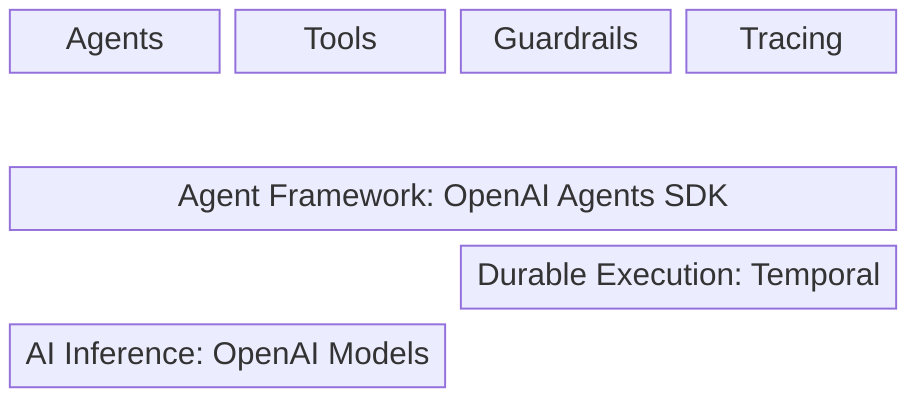

# OpenAI Agents SDK Integration for Temporal

⚠️ **Experimental** - This module is not yet stable and may change in the future.

For questions, please join the [#python-sdk](https://temporalio.slack.com/archives/CTT84RS0P) Slack channel at [temporalio.slack.com](https://temporalio.slack.com/).

## Building Crash-Proof AI Agents

The challenge with AI agents is that they can crash and lose all their progress.
If your agent is halfway through analyzing data, calling APIs, or having a conversation, a system failure means starting over from scratch.

This integration combines [OpenAI Agents SDK](https://github.com/openai/openai-agents-python) with [Temporal's durable execution](https://docs.temporal.io/evaluate/understanding-temporal#durable-execution) to build agents that never lose their work and handle long-running, asynchronous, and human-in-the-loop workflows with ease.



## How the Architecture Works

Understanding the architecture helps you build robust agent systems. Here are the key components:


**Temporal Server**: Keeps track of your agent's progress. Every decision, API call, and state change is recorded. If anything crashes, the server knows exactly where to resume. [Setup instructions](https://docs.temporal.io/dev-guide/python/foundations#run-a-temporal-service).

**Worker Process**: Runs your actual agent code. This can crash, restart, or even run on different machines. The server will send it work and track what gets completed.

**Temporal Client**: Starts and monitors your agents from your application code. It connects to the server to execute workflows.

The key insight: If your worker crashes, the server remembers everything and restarts from the exact point of failure.

## Your First Durable Agent

An agent is an LLM with instructions that can use tools to accomplish tasks. Let's build one that survives crashes.

This integration requires three files that separate concerns for reliability:

### File 1: Workflow Definition (`hello_world_workflow.py`)

```python
from temporalio import workflow
from agents import Agent, Runner

@workflow.defn
class HelloWorldAgent:
    @workflow.run
    async def run(self, prompt: str) -> str:
        # An agent is an LLM with instructions and optional tools
        agent = Agent(
            name="Assistant",
            instructions="You are a helpful assistant who responds in haikus.",
        )
        
        # Runner executes the agent's conversation loop  
        result = await Runner.run(agent, input=prompt)
        return result.final_output
```

### File 2: Worker Setup (`run_worker.py`)

```python
import asyncio
from datetime import timedelta

from temporalio.client import Client
from temporalio.contrib.openai_agents import OpenAIAgentsPlugin, ModelActivityParameters
from temporalio.worker import Worker

from hello_world_workflow import HelloWorldAgent

async def worker_main():
    # Configure Temporal client with OpenAI Agents integration
    client = await Client.connect(
        "localhost:7233",
        plugins=[
            OpenAIAgentsPlugin(
                model_params=ModelActivityParameters(
                    start_to_close_timeout=timedelta(seconds=30)
                )
            ),
        ],
    )

    # Create worker that can execute HelloWorldAgent workflows
    worker = Worker(
        client,
        task_queue="my-task-queue",
        workflows=[HelloWorldAgent],
        activities=[],  # Model activities are automatically registered by the plugin
    )
    await worker.run()

if __name__ == "__main__":
    asyncio.run(worker_main())
```

The `OpenAIAgentsPlugin` handles critical setup tasks:
- Configures data serialization for OpenAI agent objects
- Sets up tracing for agent interactions  
- Automatically runs LLM calls as Temporal activities (you don't need to register these)
- Manages the runtime needed for agents to work within Temporal workflows

### File 3: Client Execution (`run_hello_world_workflow.py`)

```python
import asyncio

from temporalio.client import Client
from temporalio.common import WorkflowIDReusePolicy
from temporalio.contrib.openai_agents import OpenAIAgentsPlugin

from hello_world_workflow import HelloWorldAgent

async def main():
    # Connect to Temporal server
    client = await Client.connect(
        "localhost:7233",
        plugins=[OpenAIAgentsPlugin()],
    )

    # Execute the agent workflow
    result = await client.execute_workflow(
        HelloWorldAgent.run,
        "Tell me about recursion in programming.",
        id="my-workflow-id",  # Use unique IDs in production
        task_queue="my-task-queue",
        id_reuse_policy=WorkflowIDReusePolicy.TERMINATE_IF_RUNNING,
    )
    print(f"Result: {result}")

if __name__ == "__main__":
    asyncio.run(main())
```

### Running Your Durable Agent

1. Start the Temporal server: `temporal server start-dev`
2. Start the worker: `python run_worker.py`
3. Execute the agent: `python run_hello_world_workflow.py`

Try stopping the worker process during execution and restarting it. The agent will resume exactly where it left off.

## Adding Tools That Can Fail and Retry

Tools let agents interact with the world - calling APIs, accessing databases, reading files. In our integration, you have two patterns for tools:

### Function Tools (Simple, Run in Workflow)

For simple computations that don't involve external calls:

```python
from agents import function_tool

@function_tool
def calculate_tip(bill: float, percentage: float) -> float:
    """Calculate tip amount for a bill."""
    return bill * (percentage / 100)
```

### Activity Tools (External Calls, Can Retry)

For anything that might fail - API calls, database queries, file operations:

```python
from dataclasses import dataclass
from datetime import timedelta
from temporalio import activity, workflow
from temporalio.contrib import openai_agents
from agents import Agent, Runner

@dataclass
class Weather:
    city: str
    temperature_range: str
    conditions: str

@activity.defn
async def get_weather(city: str) -> Weather:
    """Get weather data from external API."""
    # This API call can fail and will retry automatically
    # In a real implementation, you'd call an actual weather API
    return Weather(
        city=city, 
        temperature_range="14-20C", 
        conditions="Sunny with light wind"
    )

@workflow.defn
class WeatherAgent:
    @workflow.run
    async def run(self, question: str) -> str:
        agent = Agent(
            name="Weather Assistant",
            instructions="You are a helpful weather agent.",
            tools=[
                calculate_tip,  # Simple function tool
                openai_agents.workflow.activity_as_tool(
                    get_weather, 
                    start_to_close_timeout=timedelta(seconds=10)
                )  # Activity tool with retry capability
            ],
        )
        result = await Runner.run(agent, input=question)
        return result.final_output
```

Don't forget to register activity tools in your worker:

```python
# In your worker file
worker = Worker(
    client,
    task_queue="my-task-queue", 
    workflows=[WeatherAgent],
    activities=[get_weather],  # Register your activities
)
```

### When to Use Each Pattern

- **Function tools**: Math, string processing, simple logic that can't fail
- **Activity tools**: API calls, database queries, file I/O, anything that might need retries

Try crashing your worker during an API call. When it restarts, Temporal will retry the failed activity automatically.

### Configuring Retry Policies

You can customize how activities retry when they fail:

```python
from temporalio.common import RetryPolicy
from datetime import timedelta

@activity.defn
async def unreliable_api_call(data: str) -> str:
    """An API call that might fail and need retries."""
    # Simulate an API that fails sometimes
    import random
    if random.random() < 0.3:  # 30% failure rate
        raise Exception("API temporarily unavailable")
    return f"Processed: {data}"

# Use it with custom retry policy
agent = Agent(
    name="Resilient Agent",
    tools=[
        openai_agents.workflow.activity_as_tool(
            unreliable_api_call,
            start_to_close_timeout=timedelta(seconds=30),
            retry_policy=RetryPolicy(
                initial_interval=timedelta(seconds=1),
                maximum_interval=timedelta(seconds=10),
                maximum_attempts=5,
                backoff_coefficient=2.0,
            )
        )
    ],
)
```

This configuration will:
- Retry up to 5 times
- Start with 1-second delays, doubling each time up to 10 seconds
- Handle transient failures automatically while preserving all agent state

## Conversations That Survive Crashes

Agents need memory to have multi-turn conversations. Our integration uses `RunConfig` to maintain conversation state that survives any failure.

```python
from temporalio import workflow
from agents import Agent, Runner, RunConfig

@workflow.defn
class ConversationAgent:
    @workflow.run
    async def run(self, messages: list[str]) -> str:
        # RunConfig maintains conversation state across all interactions
        config = RunConfig()
        
        agent = Agent(
            name="Customer Support",
            instructions="You are a helpful customer support agent. Remember the conversation context.",
        )
        
        # Process each message while maintaining conversation history
        result = None
        for message in messages:
            result = await Runner.run(agent, input=message, run_config=config)
            # The conversation history is automatically preserved in config
        
        return result.final_output if result else "No messages processed"
```

Usage example:

```python
# Client code
messages = [
    "Hi, I'm having trouble with my order",
    "My order number is 12345", 
    "I need to change the shipping address"
]

import uuid

result = await client.execute_workflow(
    ConversationAgent.run,
    messages,
    id=f"customer-conversation-{uuid.uuid4()}",  # Use unique IDs in production
    task_queue="my-task-queue",
)
```

### Multi-Step Conversations with State

For more complex scenarios where you need to build up conversation state over time:

```python
@workflow.defn
class TravelPlanningAgent:
    @workflow.run
    async def run(self, destination: str, budget: str, interests: list[str]) -> str:
        config = RunConfig()
        
        agent = Agent(
            name="Travel Planner",
            instructions="You are a travel planning expert. Build comprehensive itineraries.",
            tools=[
                openai_agents.workflow.activity_as_tool(search_flights),
                openai_agents.workflow.activity_as_tool(find_hotels),
                openai_agents.workflow.activity_as_tool(get_attractions),
            ]
        )
        
        # Step 1: Gather initial preferences
        result = await Runner.run(
            agent, 
            input=f"I want to plan a trip to {destination} with a budget of {budget}",
            run_config=config
        )
        
        # Step 2: Refine based on interests
        result = await Runner.run(
            agent,
            input=f"My interests include: {', '.join(interests)}. Please find specific recommendations.",
            run_config=config
        )
        
        # Step 3: Create final itinerary
        result = await Runner.run(
            agent,
            input="Create a detailed day-by-day itinerary with all the information gathered.",
            run_config=config
        )
        
        return result.final_output
```

The key insight: All conversation history is automatically preserved, and if anything crashes during this multi-step process, it resumes from the exact step where it failed.

### Production Workflow IDs

In the examples above, we use simple workflow IDs like `"my-workflow-id"` for clarity. In production, you need unique IDs to avoid conflicts:

```python
import uuid
from datetime import datetime

# Option 1: UUID-based (most common)
workflow_id = f"agent-conversation-{uuid.uuid4()}"

# Option 2: Include timestamp and context
workflow_id = f"customer-support-{customer_id}-{datetime.now().isoformat()}"

# Option 3: Business-meaningful IDs
workflow_id = f"travel-planning-{user_id}-{trip_date}"

result = await client.execute_workflow(
    MyAgentWorkflow.run,
    "user input",
    id=workflow_id,
    task_queue="my-task-queue",
)
```

Choose IDs that help you identify and debug workflows later. Temporal uses these IDs for deduplication, so the same ID will return the existing workflow result if it's already running or completed.

## Teams of Agents Working Together

Complex tasks often need specialist agents working together. One agent can hand off work to another that's better suited for specific tasks.

In Temporal workflows, we need to use factory functions to create agents (this ensures the workflow can recreate identical agents if it needs to recover from a crash):

```python
from temporalio import workflow
from agents import Agent, Runner

def create_customer_service_agents():
    """Factory function to create agents for workflow determinism."""
    
    faq_agent = Agent(
        name="FAQ Agent",
        instructions="""You answer frequently asked questions about our company.
        If you can't answer a question, transfer to the triage agent.""",
        handoff_description="Handles frequently asked questions",
    )
    
    billing_agent = Agent(
        name="Billing Agent", 
        instructions="""You help customers with billing issues, payment problems, and account questions.
        If the issue is not billing-related, transfer to the triage agent.""",
        handoff_description="Handles billing and payment issues",
    )
    
    technical_agent = Agent(
        name="Technical Support",
        instructions="""You help customers with technical problems and troubleshooting.
        If the issue is not technical, transfer to the triage agent.""",
        handoff_description="Handles technical support issues",
    )
    
    triage_agent = Agent(
        name="Triage Agent",
        instructions="""You are the main customer service agent. Analyze customer requests and 
        transfer them to the appropriate specialist agent. Always be helpful and professional.""",
        handoffs=[faq_agent, billing_agent, technical_agent],
    )
    
    # Set up reverse handoffs so specialists can return to triage
    faq_agent.handoffs = [triage_agent]
    billing_agent.handoffs = [triage_agent] 
    technical_agent.handoffs = [triage_agent]
    
    return triage_agent

@workflow.defn
class CustomerServiceWorkflow:
    @workflow.run
    async def run(self, customer_message: str, customer_context: dict = None) -> str:
        # Create fresh agents for this workflow execution
        starting_agent = create_customer_service_agents()
        
        # Process the customer request
        result = await Runner.run(
            agent=starting_agent,
            input=customer_message,
            context=customer_context or {}
        )
        
        return result.final_output
```

### Agent Context Sharing

Agents can share context information across handoffs:

```python
from pydantic import BaseModel

class CustomerContext(BaseModel):
    customer_id: str = None
    order_number: str = None
    issue_type: str = None
    priority: str = "normal"

@workflow.defn
class AdvancedCustomerService:
    @workflow.run
    async def run(self, message: str, customer_id: str) -> str:
        # Initialize shared context
        context = CustomerContext(customer_id=customer_id)
        
        starting_agent = create_customer_service_agents()
        
        result = await Runner.run(
            agent=starting_agent,
            input=message,
            context=context
        )
        
        return result.final_output
```

Try crashing the worker during a handoff between agents. When it restarts, the conversation continues with the correct specialist agent, and all context is preserved.

## Understanding the Trade-offs

This integration gives you powerful capabilities, but it's important to understand what you gain and what you trade off.

### What You Gain

**Complete crash-proof execution**: Your agents will finish their work no matter what fails. Process crashes, network issues, server restarts - none of these affect your agent's ability to complete its task.

**Automatic retries**: Failed API calls, database timeouts, and other transient errors are automatically retried with configurable backoff strategies.

**Perfect observability**: Every decision your agent makes is recorded. You can see the complete history of what happened, when, and why.

**Horizontal scaling**: Run multiple worker processes across different machines. Temporal automatically distributes the work.

**State management**: Conversation history, context, and agent state are automatically preserved and managed.

### Current Limitations

**No real-time streaming**: At this point in time, streaming operations like `Runner.run_streamed()` are not supported. Agents complete their full response before returning results. This limitation may be addressed in future versions.

**No interactive input during execution**: You can't prompt for user input in the middle of a workflow. Design your workflows to take all necessary input as parameters upfront.

**Slightly more complex setup**: Instead of a single script, you need three files (workflow, worker, client) and a running Temporal server.

### When to Use This Integration

**Ideal for:**
- Long-running agent workflows that can't afford to lose progress
- Production systems requiring high reliability
- Multi-step agent processes with external API calls
- Systems needing audit trails and observability
- Applications that need to scale across multiple workers

**Consider alternatives for:**
- Simple, single-shot agent requests
- Real-time interactive applications requiring streaming
- Development/prototyping where setup complexity outweighs benefits
- Applications that require immediate responses without any latency

## Production Considerations

For production deployments, see the [Temporal production deployment guide](https://docs.temporal.io/production-deployment) for information about:

- High availability setup
- Monitoring and alerting
- Security configuration  
- Performance tuning
- Scaling strategies

## Additional Examples

You can find more comprehensive examples in the [Temporal Python Samples Repository](https://github.com/temporalio/samples-python/tree/main/openai_agents), including:

- **Basic Examples**: Simple agent workflows and tool usage
- **Multi-Agent Systems**: Complex handoff patterns and orchestration
- **Advanced Patterns**: State management, error handling, and scaling
- **Real-World Use Cases**: Customer service, data analysis, and workflow automation

Each example demonstrates different aspects of building production-ready AI agents with durable execution.