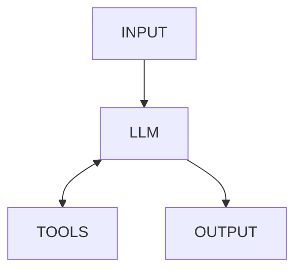

# OpenAI Agents SDK Integration for Temporal

⚠️ **Experimental** - This module is not yet stable and may change in the future.

For questions, please join the [#python-sdk](https://temporalio.slack.com/archives/CTT84RS0P) Slack channel at [temporalio.slack.com](https://temporalio.slack.com/).


## Introduction

If you want to build production-ready AI agents quickly, you can use this module to integrate [OpenAI Agents SDK](https://github.com/openai/openai-agents-python) and [Temporal durable execution](https://docs.temporal.io/evaluate/understanding-temporal#durable-execution).
Temporal provides a crash-proof system foundation, managing the distributed systems challenges inherent to production agentic systems.
OpenAI Agents SDK offers a lightweight yet powerful framework for defining those agents.
The combination lets you build reliable agentic systems quickly.


## Core Concepts

This section describes description of AI agents.

The standard control flow of a single AI agent involves:

1. Receiving *input* and handing it to an *LLM*.
2. At the direction of the LLM, calling *tools*, and returning that output back to the LLM.
3. Repeating as necessary, until the LLM produces *output*.

The diagram below illustrates an AI agent control flow.



To provide durable execution, Temporal needs to be able to recover from failures at any step of this process.
To do this, Temporal requires separating an application's deterministic (repeatable) and non-deterministic parts:

1. Deterministic pieces, termed *workflows*, execute the same way if re-run with the same inputs.
2. Non-deterministic pieces, termed *activities*, have no limitations—they may perform I/O and any other operations.

Temporal maintains a server-side execution history of all state state passing in and out of a workflow, using it to recover when needed. 
See the [Temporal documentation](https://docs.temporal.io/evaluate/understanding-temporal#temporal-application-the-building-blocks) for more information.

How do we apply the Temporal execution model to enable durable execution for AI agents?

- The core control flow, which is managed by the OpenAI Agents SDK, goes into a Temporal workflow.
- Calls to the LLM provider, which are inherently non-deterministic, go into activities.
- Calls to tools, which could contain arbitrary code, similarly go into activities.

This module ensures that LLM calls and tool calls originating from the OpenAI Agents SDK run as Temporal activities.
It also ensures that their inputs and outputs are properly serialized.

## Basic Example

Let's start with a simple example.

The first file, `hello_world_workflow.py`, defines an OpenAI agent within a Temporal workflow.

```python
# File: hello_world_workflow.py
from temporalio import workflow
from agents import Agent, Runner

@workflow.defn
class HelloWorldAgent:
    @workflow.run
    async def run(self, prompt: str) -> str:
        agent = Agent(
            name="Assistant",
            instructions="You only respond in haikus.",
        )

        result = await Runner.run(agent, input=prompt)
        return result.final_output
```

If you are familiar with Temporal and with Open AI Agents SDK, this code will look very familiar.
We annotate the `HelloWorldAgent` class with `@workflow.defn` to define a workflow, then use the `@workflow.run` annotation to define the entrypoint.
We use the `Agent` class to define a simple agent, one which always responds with haikus.
Within the workflow, we start the agent using the `Runner`, as is typical, passing through `prompt` as an argument.

The second file, `run_worker.py`, launches a Temporal worker.
This is a program that connects to the Temporal server and receives work to run, in this case `HelloWorldAgent` invocations.

```python
# File: run_worker.py

import asyncio
from datetime import timedelta

from temporalio.client import Client
from temporalio.contrib.openai_agents import OpenAIAgentsPlugin, ModelActivityParameters
from temporalio.worker import Worker

from hello_world_workflow import HelloWorldAgent


async def worker_main():
    # Use the plugin to configure Temporal for use with OpenAI Agents SDK
    client = await Client.connect(
        "localhost:7233",
        plugins=[
            OpenAIAgentsPlugin(
                model_params=ModelActivityParameters(
                    start_to_close_timeout=timedelta(seconds=30)
                )
            ),
        ],
    )

    worker = Worker(
        client,
        task_queue="my-task-queue",
        workflows=[HelloWorldAgent],
    )
    await worker.run()


if __name__ == "__main__":
    asyncio.run(worker_main())
```

We use the `OpenAIAgentsPlugin` to configure Temporal for use with OpenAI Agents SDK.
The plugin automatically handles several important setup tasks:
- Configures the Pydantic data converter to ensure proper serialization of OpenAI agent objects
- Sets up tracing interceptors for OpenAI agent interactions
- Registers model execution activities that wrap LLM calls
- Manages the runtime overrides needed for OpenAI agents to work within Temporal workflows

In order to launch the agent, use the standard Temporal workflow invocation:

```python
# File: run_hello_world_workflow.py

import asyncio

from temporalio.client import Client
from temporalio.common import WorkflowIDReusePolicy
from temporalio.contrib.openai_agents import OpenAIAgentsPlugin

from hello_world_workflow import HelloWorldAgent

async def main():
    # Create client connected to server at the given address
    client = await Client.connect(
        "localhost:7233",
        plugins=[OpenAIAgentsPlugin()],
    )

    # Execute a workflow
    result = await client.execute_workflow(
        HelloWorldAgent.run,
        "Tell me about recursion in programming.",
        id="my-workflow-id",
        task_queue="my-task-queue",
        id_reuse_policy=WorkflowIDReusePolicy.TERMINATE_IF_RUNNING,
    )
    print(f"Result: {result}")

if __name__ == "__main__":
    asyncio.run(main())
```

This launcher script executes the Temporal workflow to start the agent.

Note that we also configure the client with the `OpenAIAgentsPlugin` to ensure proper serialization of OpenAI agent data types when starting and receiving results from the workflow.


## Using Temporal Activities as OpenAI Agents Tools

One of the powerful features of this integration is the ability to convert Temporal activities into OpenAI Agents tools using `activity_as_tool`.
This allows your agent to leverage Temporal's durable execution for tool calls.

In the example below, we apply the `@activity.defn` decorator to the `get_weather` function to create a Temporal activity.
We then pass this through the `activity_as_tool` helper function to create an OpenAI Agents tool that is passed to the `Agent`.

```python
from dataclasses import dataclass
from datetime import timedelta
from temporalio import activity, workflow
from temporalio.contrib import openai_agents
from agents import Agent, Runner

@dataclass
class Weather:
    city: str
    temperature_range: str
    conditions: str

@activity.defn
async def get_weather(city: str) -> Weather:
    """Get the weather for a given city."""
    return Weather(city=city, temperature_range="14-20C", conditions="Sunny with wind.")

@workflow.defn
class WeatherAgent:
    @workflow.run
    async def run(self, question: str) -> str:
        agent = Agent(
            name="Weather Assistant",
            instructions="You are a helpful weather agent.",
            tools=[
                openai_agents.workflow.activity_as_tool(
                    get_weather, 
                    start_to_close_timeout=timedelta(seconds=10)
                )
            ],
        )
        result = await Runner.run(starting_agent=agent, input=question)
        return result.final_output
```


### Agent Handoffs

The OpenAI Agents SDK supports agent handoffs, where one agent can transfer control to another agent.
In this example, one Temporal workflow wraps the entire multi-agent system:

```python
@workflow.defn
class CustomerServiceWorkflow:
    def __init__(self):
        self.current_agent = self.init_agents()

    def init_agents(self):
        faq_agent = Agent(
            name="FAQ Agent",
            instructions="Answer frequently asked questions",
        )
        
        booking_agent = Agent(
            name="Booking Agent", 
            instructions="Help with booking and seat changes",
        )
        
        triage_agent = Agent(
            name="Triage Agent",
            instructions="Route customers to the right agent",
            handoffs=[faq_agent, booking_agent],
        )
        
        return triage_agent

    @workflow.run
    async def run(self, customer_message: str) -> str:
        result = await Runner.run(
            starting_agent=self.current_agent,
            input=customer_message,
            context=self.context,
        )
        return result.final_output
```


## Additional Examples

You can find additional examples in the [Temporal Python Samples Repository](https://github.com/temporalio/samples-python/tree/main/openai_agents).
